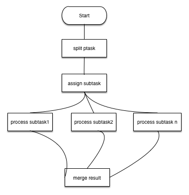

# 分布式计算框架设计方案 
>2016-09-30 Gol 
> V1.2

[TOC]

## 更新
v1.2 20161007
1. 增加任务完成接口
2. 增加进度接口
3. 增加异常处理

## 解决问题
> 单个进程实例无法高效的对大数据进行处理，采用现有的分布式计算框架不够灵活，有一定的学习难度和程序迁移难度并且对第三方框架依赖太重。

## 设计思路
> ** 简单易用 **
> 把大的任务分割成多个小任务，分配给多个运算模块处理，最后对运算结果做合并处理。
> 配合docker一起使用 可以非常灵活的横向扩展


## 关键字
* 运算实例(ALI)
```
        一个运算进程（对于一个docker实例） 每个进程有唯一的编号:ALIID 
        属性
            ALIID
            cpu个数
            内存大小
            磁盘io
                非必须
            线程数
                同时可以处理多个Subtask
            状态
            权重
                控制任务分配
            当前线程数
                在计算中的线程
            运算任务次数
            类型
                Leader
                Follower

```
* 运算单元(ALU)
```
        最小的运算单位 对应一个线程，每个ALI下可以有多个ALU 
                名称  线程数    
        分类：任务分派   1         
             任务运算   1~5
             结果合并   1
             选举单元   1
             实例检查   1
             心跳检查   1
             任务检查   1
```
* Leader 主运算实例
```
        负责任务分配
        结果分配
        运算实例存活检查
        任务检查
        发启心跳
```
* Follower 子运算实例
```
        负责子任务运算
        合并运算
        发启心跳
        选举权
            Leader挂掉后需选举产生一个新的Leader
```
* 父任务 PTask
```
        用户发起的运算需求
        属性
            PTaskId
            类型 
               区分业务
            状态
            进度
            异常信息
            业务信息
```
* 子任务 SubTask
```
        由PTask 分割而成，子任务不可以在分割
        属性
            SubTaskId
            类型
                区分业务
            状态
            进度
            异常信息
            重试次数
            业务信息
```
* 任务队列 Quere
```
        分割后的子任务、合并的结果推入队列，控制执行顺序
        属性
            TaskId
            ALIID
            类型  
                分割的子任务
                合并的结果
            状态
            重试次数
```

* 用户接口 user interface
``` 
        任务分割接口
        子任务运算接口
            子任务异常会重试3次，如果还是失败 子任务状态设为失败，最后交给合并接口处理
        合并运算接口
            合并失败不会执行重试
        自定义完成任务接口
           包括检查任务是否完成和完成任务功能
           当多个子任务同时运行时，如果有一个子任务完成，认为父任务完成
        子任务计算进度接口
           执行进度会更新数据库,会导致性能下降
```


## 处理流程
1. 任务分割
    把PTask分割为多个SubTask, 多个SubTask之间无关联关系 例如：按照患者编号分割, 每1000个患者归为一个SubTask

    PTask状态为已分割

2. 任务分派
    Subtask,PTask 状态为待分派
    Leader 分派SubTask给Follower，如果没有Follower ,Leader自己处理任务。分派规则见下文

    PTask,Subtask 状态为已分派
   
3. 任务运算
    Subtask，PTask 状态为运算中
    运算单元对SubTask进行运算，运算结果记录到mongo中，异常信息直接raise出来由框架处理

    Subtask 状态为运算完
    所有SubTask运算完成后 更改 PTask状态为运算完 

    如果类型为结果合并，计算完成后  PTask状态为已完成

4. 结果分派
    对运算的结果进行分派操作，Leader判断PTask的状态来验证是否运算完成,插入到Task 队列，由Follower执行

    PTask状态为已分派 ，接下来由第三步处理
  

流程图：


## 实例管理
* 实例注册
    ALI 启动时会注册到实例列表中，生成一个唯一号ALIID来区分。注册详细信息请见关键字部分
    Leader 负责管理实例列表
* 实例注销
    实例关闭时需求更改实例的状态为无效

* 实例监测
    ALI 会定时反馈一个消息表示自己还有效，Leader负责管理各个Follower状态

* 实例选举
    每个ALI定时监测Leader是否有效，如果有一半以上的ALI反馈Leader无效时，按照ALI处理能力(内存，cpu，当前处理任务数等)优先选择一个Leader
    原有Leader变为Follower,Leader状态改为无效 ,重新分配SubTask 

## 任务管理
* 任务分割
    提供对外接口 由业务调用
* 任务分派
    分派规则：
    1. Leader按照ALI数量平分SubTask  例如：100个SubTask,10个ALI 平均每个ALI处理10个SubTask
    2. 按照权重分派SubTask  例如：ALIA(权重20%) ALIB(权重30%) ALIC(权重50%) 100个SubTask ALIA处理20 ALIB 30 ALIC 50
    3. 动态分派SubTask   能实时判断ALI是否空闲  动态调试任务分派  比较麻烦
    
* 合并运算
    对各个SubTask的结果做合并操作

* 任务检查
    需要定时检查任务是否有效，对于僵尸的任务需要重新分派AUI,由Leader负责处理

## 监控功能
* 可以实时查看实例信息和任务信息
* 实时反馈异常信息
* 图形页面展示

## 组件设计
* 实例管理组件
* 任务管理组件
* 监控组件
* 数据源组件
* 分割组件
* 执行对象组件 
    实现自定义业务
 
Thanks!! That's Over